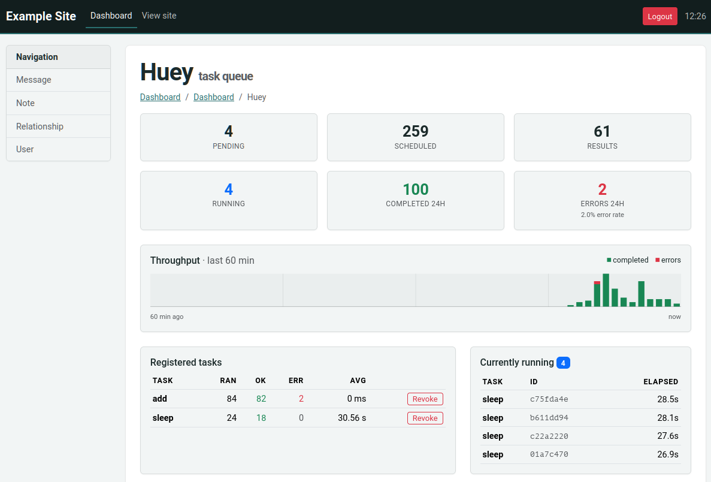

.. _flask-admin:

Flask-Peewee admin
------------------

:py:class:`HueyPanel` adds a huey monitoring dashboard to the admin site
provided by `flask-peewee <https://github.com/coleifer/flask-peewee>`_. The
dashboard shows live queue depths, currently-running tasks, recent events,
per-task throughput and error-rates, and provides controls for revoking or
restoring tasks and flushing the queue, schedule, results or locks.

The panel is a front-end for the :ref:`task statistics engine <task-stats>`,
so its data comes from two places:

* :py:func:`enable_stats` runs in the **consumer** and records task signals
  (executing, complete, error, ...) into the stats database. See
  :ref:`task-stats` for details.
* :py:class:`HueyPanel` runs in your **web** application and renders that
  recorded history alongside live queue introspection.

Both point at the same database, so it must be reachable by both processes.

Registering the panel
^^^^^^^^^^^^^^^^^^^^^^

Register the panel with your flask-peewee ``Admin`` instance, passing
the huey instance as an extra argument:

.. code-block:: python

    from huey.contrib.flask_admin import HueyPanel

    admin.register_panel('Huey', HueyPanel, huey)

By default the panel stores and reads statistics in your admin's authentication
database (``admin.auth.db``). To keep them elsewhere, pass a database
explicitly:

.. code-block:: python

    admin.register_panel('Huey', HueyPanel, huey, stats_db)

Registering the panel also calls :py:func:`enable_stats`, so the stats tables
are created when the admin site starts up and the web process records any
signals it sees (such as tasks enqueued from a request).

To capture task **execution**, which feeds the throughput, per-task and event
views, enable the recorder in the consumer as well (:ref:`task-stats`).
Without it, the panel still shows the live queue counts (pending, scheduled,
results), but the history tables remain empty.

.. py:class:: HueyPanel

    A flask-peewee ``AdminPanel`` subclass. Register it with
    ``Admin.register_panel()``, passing the huey instance and, optionally,
    the stats database:

    .. code-block:: python

        admin.register_panel('Huey', HueyPanel, huey)            # db = admin.auth.db
        admin.register_panel('Huey', HueyPanel, huey, stats_db)
