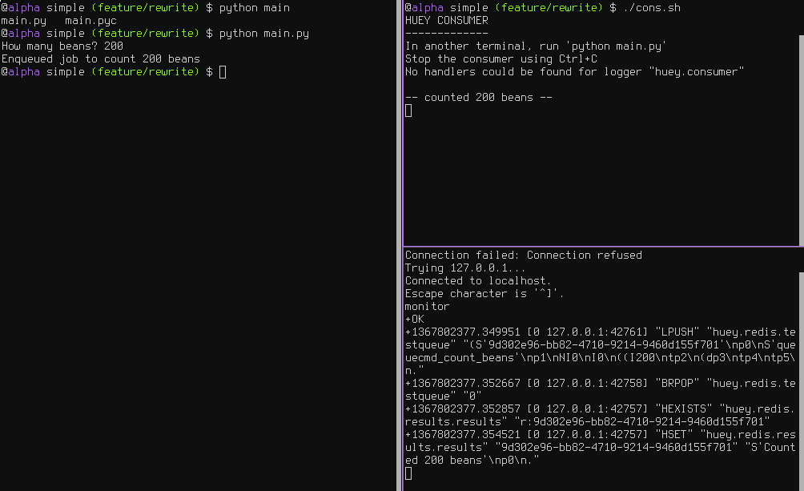
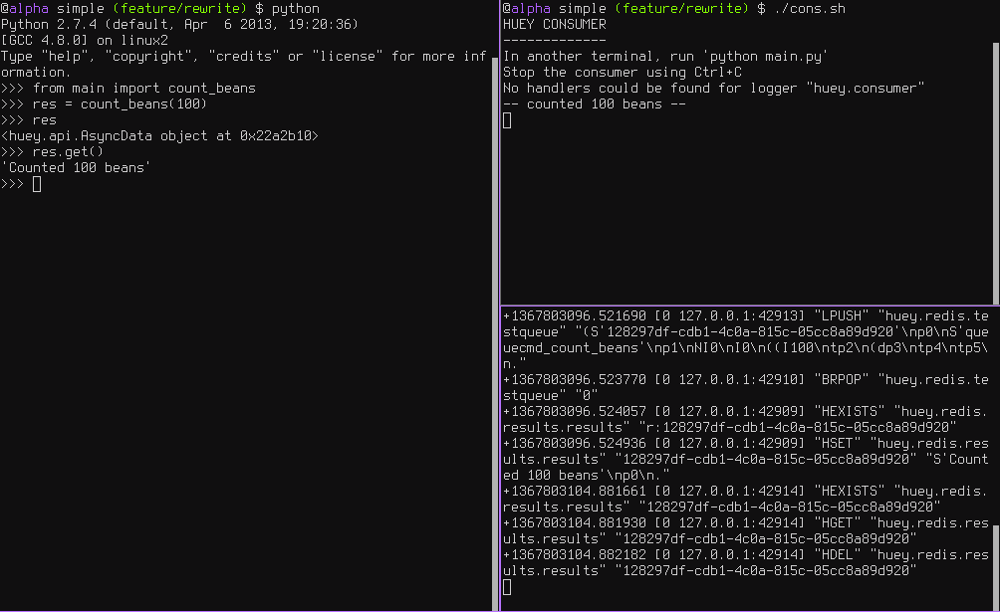
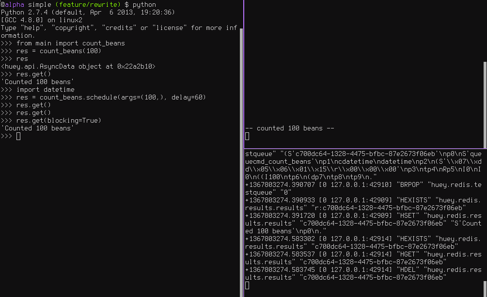
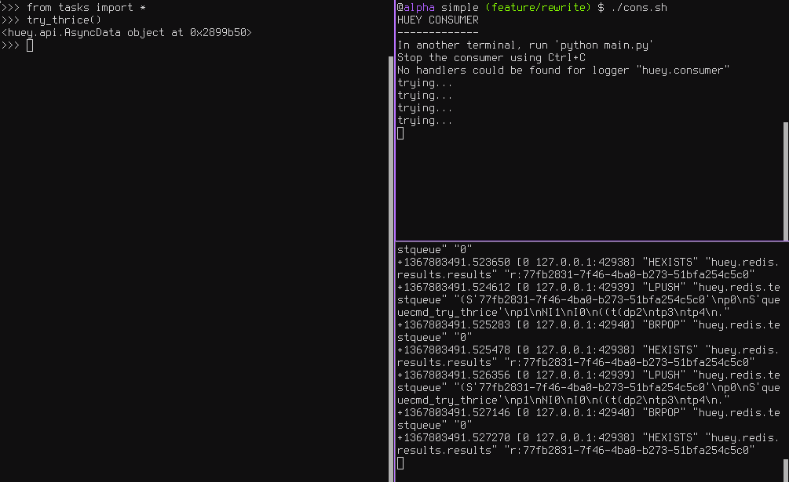
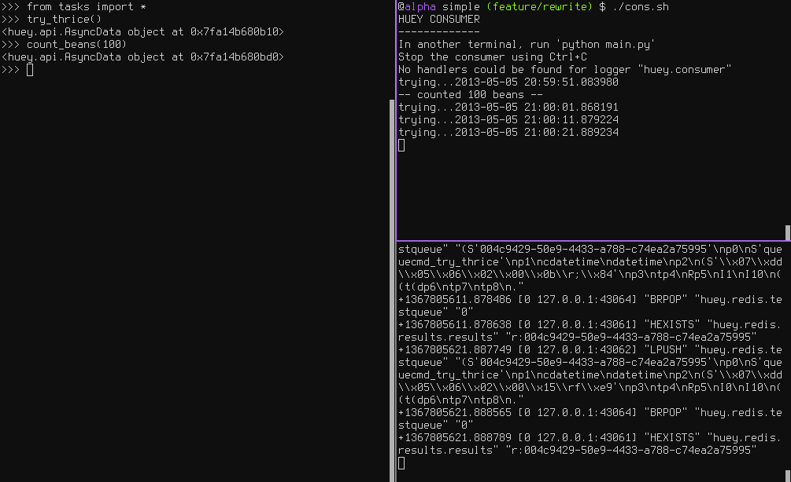
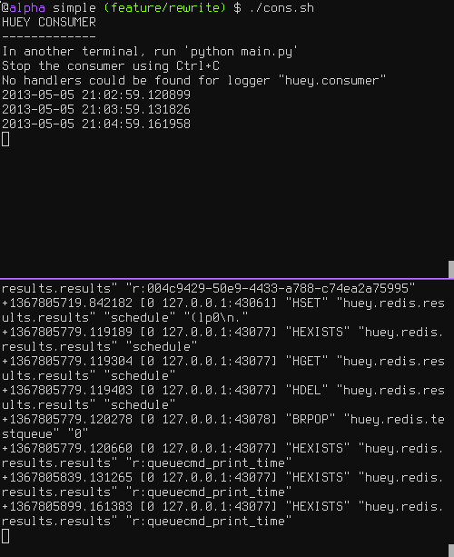

.. _getting-started:

Getting Started
===============

The goal of this document is to help you get running quickly and with as little
fuss as possible.

.. _getting-started-python:

General guide
^^^^^^^^^^^^^

There are three main components (or processes) to consider when running huey:

* the producer(s), i.e. a web application
* the consumer(s), which executes jobs placed into the queue
* the queue where tasks are stored, e.g. Redis

These three processes are shown in the screenshots that follow. The left-hand pane
shows the producer: a simple program that asks the user for input on how many
"beans" to count.  In the top-right, the consumer is running.  It is doing the
actual "computation", for example printing the number of beans counted.  In the
bottom-right is the queue, Redis in this example. We can see the tasks being
enqueued (``LPUSH``) and read (``BRPOP``) from the database.

Trying it out yourself
----------------------

Assuming you've got :ref:`huey installed <installation>`, let's look at the code
from this example.

The first step is to configure your queue.  The consumer needs to be pointed at
a :py:class:`Huey` instance, which specifies which backend to use.

.. code-block:: python

    # config.py
    from huey import RedisHuey

    huey = RedisHuey()

The ``huey`` object encapsulates a queue. The queue is responsible for
storing and retrieving messages, and the ``huey`` instance is used by your
application code to coordinate function calls with a queue backend.  We'll
see how the ``huey`` object is used when looking at the actual function
responsible for counting beans:

.. code-block:: python

    # tasks.py
    from config import huey # import the huey we instantiated in config.py

    @huey.task()
    def count_beans(num):
        print('-- counted %s beans --' % num)

The above example shows the API for writing "tasks" that are executed by the
queue consumer -- simply decorate the code you want executed by the consumer
with the :py:meth:`~Huey.task` decorator and when it is called, the main
process will return *immediately* after enqueueing the function call. In a
separate process, the consumer will see the new message and run the function.

Our main executable is very simple.  It imports both the configuration **and**
the tasks - this is to ensure that when we run the consumer by pointing it
at the configuration, the tasks are also imported and loaded into memory.

.. code-block:: python

    # main.py
    from config import huey  # import our "huey" object
    from tasks import count_beans  # import our task

    if __name__ == '__main__':
        beans = raw_input('How many beans? ')
        count_beans(int(beans))
        print('Enqueued job to count %s beans' % beans)

To run these scripts, follow these steps:

1. Ensure you have `Redis <http://redis.io>`_ running locally
2. Ensure you have :ref:`installed huey <installation>`
3. Start the consumer: ``huey_consumer.py main.huey`` (notice this is "main.huey"
   and not "config.huey").
4. Run the main program: ``python main.py``

Getting results from jobs
-------------------------

The above example illustrates a "send and forget" approach, but what if your
application needs to do something with the results of a task?  To get results
from your tasks, just return a value in your task function.

.. note::
    If you are storing results but are not using them, that can waste significant space, especially if your task volume is high. To disable result storage, you can either return ``None`` or specify ``result_store=False`` when initializing your :py:class:`Huey` instance.

To better illustrate getting results, we'll also modify the ``tasks.py``
module to return a string rather in addition to printing to stdout:

.. code-block:: python

    from config import huey

    @huey.task()
    def count_beans(num):
        print('-- counted %s beans --' % num)
        return 'Counted %s beans' % num

We're ready to fire up the consumer.  Instead of simply executing the main
program, though, we'll start an interpreter and run the following:

.. code-block:: pycon

    >>> from main import count_beans
    >>> res = count_beans(100)
    >>> print(res)                      # What is "res" ?
    <huey.api.TaskResultWrapper object at 0xb7471a4c>

    >>> res()                          # Get the result of this task
    'Counted 100 beans'

Following the same layout as our last example, here is a screenshot of the three
main processes at work:

1. Top-left, interpreter which produces a job then asks for the result
2. Top-right, the consumer which runs the job and stores the result
3. Bottom-right, the Redis database, which we can see is storing the results and
   then deleting them after they've been retrieved

Executing tasks in the future
------------------------------

It is often useful to enqueue a particular task to execute at some arbitrary time
in the future, for example, mark a blog entry as published at a certain time.

This is very simple to do with huey.  Returning to the interpreter session from
the last section, let's schedule a bean counting to happen one minute in the future
and see how huey handles it.  Execute the following:

.. code-block:: pycon

    >>> import datetime
    >>> res = count_beans.schedule(args=(100,), delay=60)
    >>> print(res)
    <huey.api.TaskResultWrapper object at 0xb72915ec>

    >>> res()  # This returns None, no data is ready.

    >>> res()  # A couple seconds later.

    >>> res(blocking=True)  # OK, let's just block until its ready
    'Counted 100 beans'

You can specify an "estimated time of arrival" as well using datetimes:

.. code-block:: pycon

    >>> in_a_minute = datetime.datetime.now() + datetime.timedelta(seconds=60)
    >>> res = count_beans.schedule(args=(100,), eta=in_a_minute)

.. note::
    By default, the Huey consumer runs in UTC-mode. The effect of this on
    scheduled tasks is that when using naive datetimes, they must be with
    respect to ``datetime.utcnow()``.

    The reason we aren't using ``utcnow()`` in the example above is because
    the ``schedule()`` method takes a 3rd parameter, ``convert_utc``, which
    defaults to ``True``. So in the above code, the datetime is converted from
    localtime to UTC before being sent to the queue.

    If you are running the consumer in localtime-mode (``-o``), then you should
    **always** specify ``convert_utc=False`` with ``.schedule()``, including
    when you are specifying a ``delay``.

Looking at the redis output, we see the following (simplified for reability)::

    +1325563365.910640 "LPUSH" count_beans(100)
    +1325563365.911912 "BRPOP" wait for next job
    +1325563365.912435 "HSET" store 'Counted 100 beans'
    +1325563366.393236 "HGET" retrieve result from task
    +1325563366.393464 "HDEL" delete result after reading

Here is a screenshot showing the same:

Retrying tasks that fail
------------------------

Huey supports retrying tasks a finite number of times.  If an exception is raised
during the execution of the task and ``retries`` have been specified, the task
will be re-queued and tried again, up to the number of retries specified.

Here is a task that will be retried 3 times and will blow up every time:

.. code-block:: python

    # tasks.py
    from config import huey

    @huey.task()
    def count_beans(num):
        print('-- counted %s beans --' % num)
        return 'Counted %s beans' % num

    @huey.task(retries=3)
    def try_thrice():
        print('trying....')
        raise Exception('nope')

The console output shows our task being called in the main interpreter session,
and then when the consumer picks it up and executes it we see it failing and being
retried:

Oftentimes it is a good idea to wait a certain amount of time between retries.
You can specify a *delay* between retries, in seconds, which is the minimum time
before the task will be retried.  Here we've modified the command to include a
delay, and also to print the current time to show that its working.

.. code-block:: python

    # tasks.py
    from datetime import datetime

    from config import huey

    @huey.task(retries=3, retry_delay=10)
    def try_thrice():
        print('trying....%s' % datetime.now())
        raise Exception('nope')

The console output below shows the task being retried, but in between retries I've
also "counted some beans" -- that gets executed normally, in between retries.

Executing tasks at regular intervals
------------------------------------

The final usage pattern supported by huey is the execution of tasks at regular
intervals.  This is modeled after ``crontab`` behavior, and even follows similar
syntax.  Tasks run at regular intervals and should not return meaningful results, nor
should they accept any parameters.

Let's add a new task that prints the time every minute -- we'll use this to
test that the consumer is executing the tasks on schedule.

.. code-block:: python

    # tasks.py
    from datetime import datetime
    from huey import crontab

    from config import huey

    @huey.periodic_task(crontab(minute='*'))
    def print_time():
        print(datetime.now())

Now, when we run the consumer it will start printing the time every minute:

Canceling or pausing tasks
--------------------------

It is possible to prevent tasks from executing.  This applies to normal tasks,
tasks scheduled in the future, and periodic tasks.

.. note:: In order to "revoke" tasks you will need to specify a ``result_store``
    when instantiating your :py:class:`Huey` object.

You can cancel a normal task provided the task has not started execution by
the consumer:

.. code-block:: python

    # count some beans
    res = count_beans(10000000)

    # provided the command has not started executing yet, you can
    # cancel it by calling revoke() on the TaskResultWrapper object
    res.revoke()

The same applies to tasks that are scheduled in the future:

.. code-block:: python

    res = count_beans.schedule(args=(100000,), eta=in_the_future)
    res.revoke()

    # and you can actually change your mind and restore it, provided
    # it has not already been "skipped" by the consumer
    res.restore()

To revoke all instances of a given task, use the ``revoke()`` and ``restore()``
methods on the task itself:

.. code-block:: python

    count_beans.revoke()
    assert count_beans.is_revoked() is True

    res = count_beans(100)
    assert res.is_revoked() is True

    count_beans.restore()
    assert count_beans.is_revoked() is False

Canceling or pausing periodic tasks
-----------------------------------

When we start dealing with periodic tasks, the options for revoking get
a bit more interesting.

We'll be using the print time command as an example:

.. code-block:: python

    @huey.periodic_task(crontab(minute='*'))
    def print_time():
        print(datetime.now())

We can prevent a periodic task from executing on the next go-round:

.. code-block:: python

    # only prevent it from running once
    print_time.revoke(revoke_once=True)

Since the above task executes every minute, what we will see is that the
output will skip the next minute and then resume normally.

We can prevent a task from executing until a certain time:

.. code-block:: python

    # prevent printing time for 10 minutes
    now = datetime.datetime.utcnow()
    in_10 = now + datetime.timedelta(seconds=600)

    print_time.revoke(revoke_until=in_10)

.. note::
    When specifying the ``revoke_until`` setting, naive datetimes should be
    with respect to ``datetime.utcnow()`` if the consumer is running in
    UTC-mode (the default). Use ``datetime.now()`` if the consumers is running
    in localtime-mode (``-o``).

Finally, we can prevent the task from running indefinitely:

.. code-block:: python

    # will not print time until we call revoke() again with
    # different parameters or restore the task
    print_time.revoke()
    assert print_time.is_revoked() is True

At any time we can restore the task and it will resume normal
execution:

.. code-block:: python

    print_time.restore()

Task Pipelines
--------------

Huey supports pipelines (or chains) of one or more tasks that should be
executed sequentially.

To get started with pipelines, let's first look behind-the-scenes at what
happens when you invoke a ``task``-decorated function:

.. code-block:: python

    @huey.task()
    def add(a, b):
        return a + b

    result = add(1, 2)

    # Is equivalent to:
    task = add.s(1, 2)
    result = huey.enqueue(task)

The :py:meth:`TaskWrapper.s` method is used to create a :py:class:`QueueTask`
instance which represents the execution of the given function. The
``QueueTask`` is serialized and enqueued, then dequeued, deserialized and
executed by the consumer.

To create a pipeline, we will use the :py:meth:`TaskWrapper.s` method to create
a :py:class:`QueueTask` instance. We can then chain additional tasks using the
:py:meth:`QueueTask.then` method:

.. code-block:: python

    add_task = add.s(1, 2)  # Create QueueTask to represent task invocation.

    # Add additional tasks to pipeline by calling QueueTask.then().
    pipeline = (add_task
                .then(add, 3)  # Call add() with previous result and 3.
                .then(add, 4)  # etc...
                .then(add, 5))

    results = huey.enqueue(pipeline)

    # Print results of above pipeline.
    print([result.get(blocking=True) for result in results])

    # [3, 6, 10, 15]

When enqueueing a task pipeline, the return value will be a list of
:py:class:`TaskResultWrapper` objects, one for each task in the pipeline.

Note that the return value from the parent task is passed to the child task,
and so-on.

If the value returned by the parent function is a ``tuple``, then the tuple
will be used to update the ``*args`` for the child function.  Likewise, if the
parent function returns a ``dict``, then the dict will be used to update the
``**kwargs`` for the child function.

Example of chaining fibonacci calculations:

.. code-block:: python

    @huey.task()
    def fib(a, b=1):
        a, b = a + b, a
        return (a, b)  # returns tuple, which is passed as *args

    pipe = (fib.s(1)
            .then(fib)
            .then(fib))
    results = huey.enqueue(pipe)

    print([result.get(blocking=True) for result in results])
    # [(2, 1), (3, 2), (5, 3)]

Here is an example of returning a dictionary to be passed in as
keyword-arguments to the child function:

.. code-block:: python

    @huey.task()
    def stateful(v1=None, v2=None, v3=None):
        state = {
            'v1': v1 + 1 if v1 is not None else 0,
            'v2': v2 + 2 if v2 is not None else 0,
            'v3': v3 + 3 if v3 is not None else 0}
        return state

    pipe = (stateful
            .s()
            .then(stateful)
            .then(stateful))

    results = huey.enqueue(pipe)
    print([result.get(True) for result in results])

    # Prints:
    # [{'v1': 0, 'v2': 0, 'v3': 0},
    #  {'v1': 1, 'v2': 2, 'v3': 3},
    #  {'v1': 2, 'v2': 4, 'v3': 6}]

For more information, see the documentation on :py:meth:`TaskWrapper.s` and
:py:meth:`QueueTask.then`.

Locking tasks
-------------

Task locking can be accomplished using the :py:meth:`Huey.lock_task` method,
which acts can be used as a context-manager or decorator.

This lock is designed to be used to prevent multiple invocations of a task from
running concurrently. If using the lock as a decorator, place it directly above
the function declaration.

If a second invocation occurs and the lock cannot be acquired, then a special
exception is raised, which is handled by the consumer. The task will not be
executed and an ``EVENT_LOCKED`` will be emitted. If the task is configured to
be retried, then it will be retried normally, but the failure to acquire the
lock is not considered an error.

Examples:

.. code-block:: python

    @huey.periodic_task(crontab(minute='*/5'))
    @huey.lock_task('reports-lock')
    def generate_report():
        # If a report takes longer than 5 minutes to generate, we do
        # not want to kick off another until the previous invocation
        # has finished.
        run_report()

    @huey.periodic_task(crontab(minute='0'))
    def backup():
        # Generate backup of code
        do_code_backup()

        # Generate database backup. Since this may take longer than an
        # hour, we want to ensure that it is not run concurrently.
        with huey.lock_task('db-backup'):
            do_db_backup()

Reading more
------------

That sums up the basic usage patterns of huey.  Below are links for details
on other aspects of the API:

* :py:class:`Huey` - responsible for coordinating executable tasks and queue backends
* :py:meth:`Huey.task` - decorator to indicate an executable task
* :py:meth:`Huey.periodic_task` - decorator to indicate a task that executes at periodic intervals
* :py:meth:`TaskResultWrapper.get` - get the return value from a task
* :py:func:`crontab` - a function for defining what intervals to execute a periodic command

Also check out the :ref:`notes on running the consumer <consuming-tasks>`.
