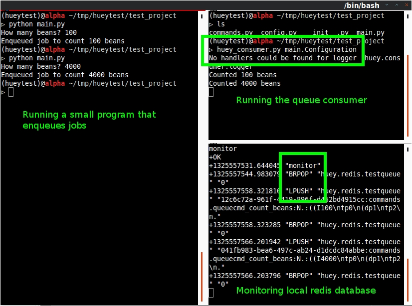
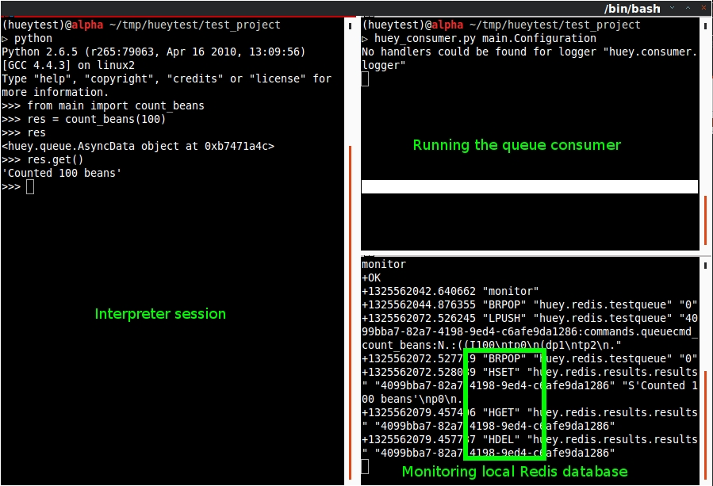
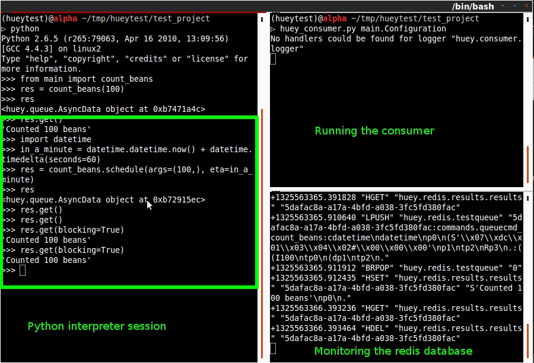
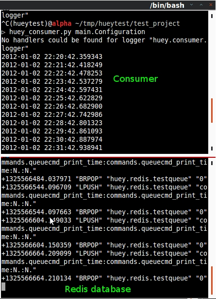
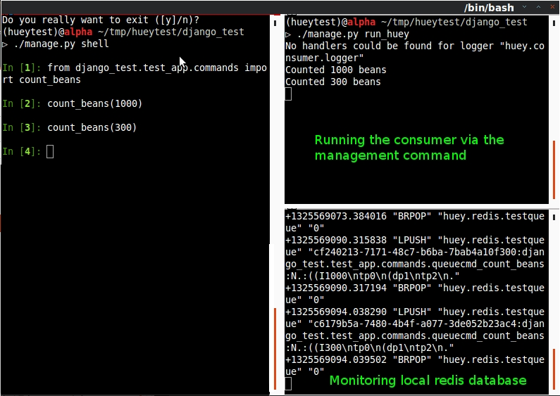

.. _getting-started:

Getting Started
===============

The goal of this document is to help you get running quickly and with as little
fuss as possible.  Because huey works with python in general but also has some
special django integration, this guide is broken up into two parts.  Read the
general guide first, then continue on to the django guide, as information is
presented in the general guide that is not covered in the django parts.

* :ref:`General guide <getting-started-python>`
* :ref:`Django integration <getting-started-django>`

.. _getting-started-python:

General guide
-------------

There are three main components (or processes) to consider when running huey:

* the producer(s), i.e. a web application
* the consumer(s), which executes jobs placed into the queue
* the queue where tasks are stored, e.g. Redis

These three processes are shown in the screenshot below -- the left-hand pane
shows the producer: a simple program that asks the user for input on how many 
"beans" to count.  In the top-right, the consumer is running.  It is doing the 
actual "computation" and simply printing the number of beans counted.  In the 
bottom-right is the queue, Redis in this example, which we're monitoring and
shows tasks being enqueued (``LPUSH``) and read (``BRPOP``) from the database.

Trying it out yourself
^^^^^^^^^^^^^^^^^^^^^^

Assuming you've got :ref:`huey installed <installation>`, let's look at the code
from this example.

The first step is to configure your queue.  The consumer needs to be pointed at
a subclass of :py:class:`BaseConfiguration`, which specifies things like the backend to
use, where to log activity, etc.

.. code-block:: python

    # config.py
    from huey.backends.redis_backend import RedisBlockingQueue
    from huey.bin.config import BaseConfiguration
    from huey.queue import Invoker

    queue = RedisBlockingQueue('test-queue', host='localhost', port=6379)
    invoker = Invoker(queue)

    class Configuration(BaseConfiguration):
        QUEUE = queue
        THREADS = 4

The interesting parts of this configuration module are the :py:class:`Invoker` object
and the :py:class:`RedisBlockingQueue` object.  The ``queue`` is responsible for 
storing and retrieving messages, and the ``invoker`` is used by your application 
code to coordinate function calls with a queue backend.  We'll see how the ``invoker`` 
is used when looking at the actual function responsible for counting beans:

.. code-block:: python

    # commands.py
    from huey.decorators import queue_command

    from config import invoker # import the invoker we instantiated in config.py

    @queue_command(invoker)
    def count_beans(num):
        print 'Counted %s beans' % num

The above example shows the API for writing "commands" that are executed by the
queue consumer -- simply decorate the code you want executed by the consumer
with the :py:func:`queue_command` decorator and when it is called, the main
process will return *immediately* after enqueueing the function call.  The
``invoker`` is passed in to the decorator, which instructs huey where to send
the message.

The main executable is very simple.  It imports both the configuration **and**
the commands - this is to ensure that when we run the consumer by pointing it
at the configuration, the commands are also imported and loaded into memory.

.. code-block:: python

    # main.py
    from config import Configuration # import the configuration class
    from commands import count_beans # import our command

    if __name__ == '__main__':
        beans = raw_input('How many beans? ')
        count_beans(int(beans))
        print 'Enqueued job to count %s beans' % beans

To run these scripts, follow these steps:

1. Ensure you have `Redis <http://redis.io>`_ running locally
2. Ensure you have :ref:`installed huey <installation>`
3. Start the consumer: ``huey_consumer.py main.Configuration``
4. Run the main program: ``python main.py``

Getting results from jobs
^^^^^^^^^^^^^^^^^^^^^^^^^

The above example illustrates a "send and forget" approach, but what if your
application needs to do something with the results of a task?  To get results 
from your tasks, we'll set up the ``RedisDataStore`` by adding the following
lines to the ``config.py`` module:

.. code-block:: python

    from huey.backends.redis_backend import RedisBlockingQueue, RedisDataStore
    from huey.bin.config import BaseConfiguration
    from huey.queue import Invoker

    queue = RedisBlockingQueue('test-queue', host='localhost', port=6379)
    result_store = RedisDataStore('results', host='localhost', port=6379) # new

    invoker = Invoker(queue, result_store=result_store) # added result store

    class Configuration(BaseConfiguration):
        QUEUE = queue
        RESULT_STORE = result_store # added
        THREADS = 4

To better illustrate getting results, we'll also modify the ``commands.py``
module to return a string rather than simply printing to stdout:

.. code-block:: python

    from huey.decorators import queue_command

    from config import invoker

    @queue_command(invoker)
    def count_beans(num):
        return 'Counted %s beans' % num # changed "print" to "return"

We're ready to fire up the consumer.  Instead of simply executing the main
program, though, we'll start an interpreter and run the following:

.. code-block:: python

    >>> from main import count_beans
    >>> res = count_beans(100)
    >>> res # <--- what is "res" ?
    <huey.queue.AsyncData object at 0xb7471a4c>
    >>> res.get() # <--- get the result of this task
    'Counted 100 beans'

Following the same layout as our last example, here is a screenshot of the three
main processes at work:

1. Top-left, interpreter which produces a job then asks for the result
2. Top-right, the consumer which runs the job and stores the result
3. Bottom-right, the Redis database, which we can see is storing the results and
   then deleting them after they've been retrieved

Executing tasks in the future
^^^^^^^^^^^^^^^^^^^^^^^^^^^^^

It is often useful to enqueue a particular task to execute at some arbitrary time
in the future, for example, mark a blog entry as published at a certain time.

This is very simple to do with huey.  Returning to the interpreter session from
the last section, let's schedule a bean counting to happen one minute in the future
and see how huey handles it.  Execute the following:

.. code-block:: python

    >>> import datetime
    >>> in_a_minute = datetime.datetime.now() + datetime.timedelta(seconds=60)
    >>> res = count_beans.schedule(args=(100,), eta=in_a_minute)
    >>> res
    <huey.queue.AsyncData object at 0xb72915ec>
    >>> res.get() # <--- this returns None, no data is ready
    >>> res.get() # <--- still no data...
    >>> res.get(blocking=True) # <--- ok, let's just block until its ready
    'Counted 100 beans'

Looking at the redis output, we see the following (simplified for reability)::

    +1325563365.910640 "LPUSH" count_beans(100)
    +1325563365.911912 "BRPOP" wait for next job
    +1325563365.912435 "HSET" store 'Counted 100 beans'
    +1325563366.393236 "HGET" retrieve result from task
    +1325563366.393464 "HDEL" delete result after reading

Here is a screenshot showing the same:

Executing tasks at regular intervals
^^^^^^^^^^^^^^^^^^^^^^^^^^^^^^^^^^^^

The final usage pattern supported by huey is the execution of tasks at regular
intervals.  This is modeled after ``crontab`` behavior, and even follows similar
syntax.  Tasks run at regular intervals and should not return meaningful results, nor
should they accept any parameters.

Let's add a new task that prints the time every minute -- we'll use this to
test that the consumer is executing the tasks on schedule.

.. code-block:: python

    # commands.py
    import datetime
    from huey.decorators import queue_command, periodic_command, crontab

    from config import invoker

    @queue_command(invoker)
    def count_beans(num):
        return 'Counted %s beans' % num

    @periodic_command(invoker, crontab(minute='*'))
    def print_time():
        print datetime.datetime.now()

Additionally, we need to indicate in the ``Configuration`` object that we want
to run periodic tasks.  The reason this is configurable is because if you were
wanting to run multiple consumer processes, only *one* of them should be responsible
for enqueueing periodic commands.  The configuration now looks like this:

.. code-block:: python

    # config.py excerpt
    class Configuration(BaseConfiguration):
        QUEUE = queue
        RESULT_STORE = result_store
        PERIODIC = True # <-- new

Now, when we run the consumer it will start printing the time every minute:

Reading more
^^^^^^^^^^^^

That sums up the basic usage patterns of huey.  If you plan on using with django,
read on -- otherwise check the detailed documentation on the following:

* :py:class:`~huey.bin.config.BaseConfiguration` - configuration options
* :py:class:`~huey.backends.base.BaseQueue` - the queue interface and writing your own backends
* :py:class:`~huey.backends.base.BaseDataStore` - the simple data store used for results and schedule serialization
* :py:class:`~huey.queue.Invoker` - responsible for coordinating executable tasks and queue backends
* :py:func:`~huey.decorators.queue_command` - decorator to indicate an executable task
* :py:func:`~huey.decorators.periodic_command` - decorator to indicate a task that executes at periodic intervals
* :py:func:`~huey.decorators.crontab` - a function for defining what intervals to execute a periodic command

.. _getting-started-django:

Django integration
------------------

Configuring huey to work with django is actually more simple due to the centralized
nature of django's configuration and conventions.  Rather than maintaining a ``Configuration``
object, as in the above example, everything is configured automatically using django
settings.  Following the previous example, we'll re-create the bean counting task
using django:

First let's get the settings.  In the interests of focusing on the bare minimum
to get things running, here are the only settings you need.  It assumes, in addition
to the ``huey.djhuey`` app, a single app called ``test_app``:

.. code-block:: python

    INSTALLED_APPS = [
        'huey.djhuey',
        'test_app',
    ]

    HUEY_CONFIG = {
        'QUEUE': 'huey.backends.redis_backend.RedisBlockingQueue',
        'QUEUE_NAME': 'test-queue',
        'QUEUE_CONNECTION': {
            'host': 'localhost',
            'port': 6379,
        },
        'THREADS': 4,
    }

The ``test_app`` will be as simple as possible:

* __init__.py (empty)
* manage.py (standard)
* settings.py
* test_app/
    - __init__.py (empty)
    - models.py (empty)
    - commands.py

The only file with any code in it is ``test_app.commands``:

.. code-block:: python

    from huey.djhuey.decorators import queue_command

    @queue_command
    def count_beans(number):
        print 'Counted %s beans' % number

If you're comparing against the example describe in the previous section, there
are a couple key differences:

* import has change from ``huey.decorators`` to ``huey.djhuey.decorators``
* ``@queue_command`` decorator does not take any parameters

Let's test it out:

1. Start up the consumer using the management command: ``django-admin.py run_huey``
2. Open up a shell: ``django-admin.py shell``
3. Try running the ``count_beans()`` function a couple times

Configuring a result backend
^^^^^^^^^^^^^^^^^^^^^^^^^^^^

To enable support for task results, define a ``RESULT_STORE`` in the django
settings module:

.. code-block:: python

    HUEY_CONFIG = {
        'QUEUE': 'huey.backends.redis_backend.RedisBlockingQueue',
        'QUEUE_NAME': 'test-queue',
        'QUEUE_CONNECTION': {
            'host': 'localhost',
            'port': 6379,
        },
        'RESULT_STORE': 'huey.backends.redis_backend.RedisDataStore',
        'RESULT_STORE_CONNECTION': {
            'host': 'localhost',
            'port': 6379,
        },
        'THREADS': 4,
    }
